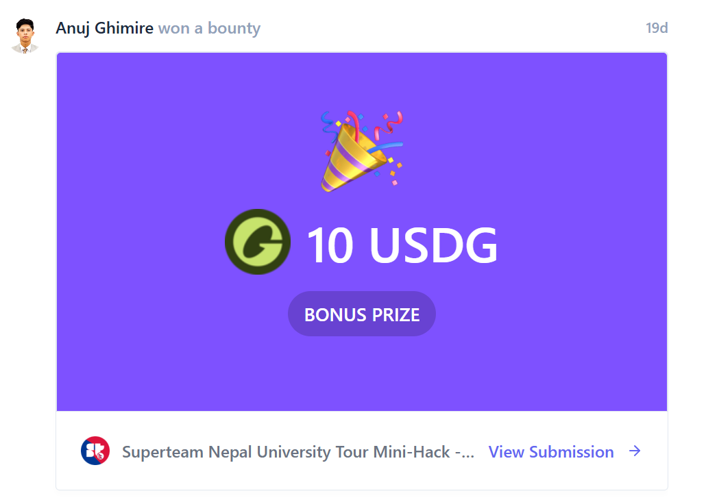
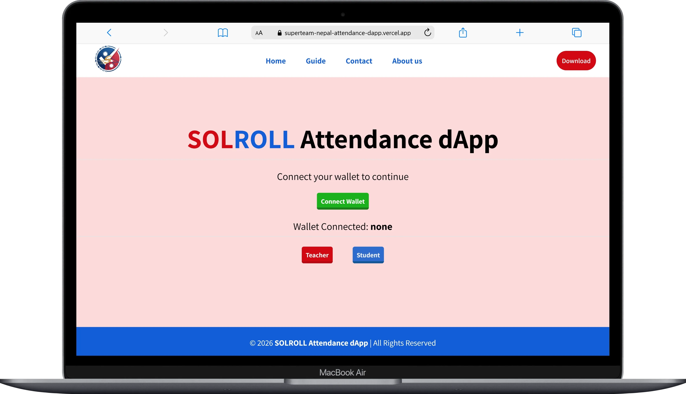

# SOLROLL Attendance dApp

---

## 🏆 Bounty Achievement

  

This project was recognized as a **bounty-winning submission**.

---

## Project Overview 🚀

**SOLROLL Attendance dApp** was built as part of the **Superteam Nepal University Tour mini-hack.**

The goal was to **create a beginner-friendly but fully functional Solana dApp** where teachers can mark attendance and students can view verified records.

---

## Motivation & Problem Statement

In traditional educational institutions, attendance tracking is often **manual, prone to errors, and lacks transparency**.

This dApp solves the problem by:

- Making attendance **tamper-proof** using Solana blockchain
- Allowing students to **verify records instantly**
- Demonstrating a **modern, decentralized approach** for educational tools

---

## Features ✨

- **Teacher Dashboard:** Mark attendance on Solana Devnet
- **Student Dashboard:** View attendance with transaction IDs
- **Wallet Integration:** Connect via Phantom Wallet
- **Local Storage Backup:** Stores attendance locally for demo purposes
- **Learning-Oriented:** Perfect for beginners to explore Solana dApps

---

## Preview / Demo Videos 🎥

  

Watch the project in action:

- **Teacher Dashboard:** [Watch Video](https://youtu.be/V4OuqK_0ssc)
- **Student Dashboard:** [Watch Video](https://youtu.be/s-v4pK3ujjc)

---

## Live Project 🌐

Access the live dApp here:  
[**SOLROLL Attendance dApp Live Demo**](https://superteam-nepal-attendance-dapp.vercel.app/)

---

## How to Use 📖

### Login

- Enter **name** and select **role** (Teacher or Student)
- Click **Continue** to go to Home

### Home Page

- Teachers: Click **Connect Wallet** (Phantom required)
- Wallet address appears partially
- Click **Teacher** or **Student** button to enter dashboard

### Teacher Dashboard

- Select a student and mark **Present** or **Absent**
- Click **Mark Attendance** to submit to Solana
- Attendance appears with date and blockchain transaction

### Student Dashboard

- View attendance history: **Date | Transaction ID | Status**
- Use **Back to Home** for navigation

---

## Hackathon Participation 🏆

This project was submitted to the **Superteam Nepal University Tour Solana Mini-Hack**.

**Evaluation criteria addressed:**

- Problem clarity & idea
- UX and design
- Technical implementation
- Completeness & demo videos
- Public GitHub repository & documentation

---

## Tech Stack 💻

- **Frontend:** HTML, CSS, JavaScript
- **Blockchain:** Solana Devnet
- **Wallet Integration:** Phantom Wallet
- **Local Storage:** Demo data persistence

---

## Learning Outcomes 📚

- Integrating **Solana blockchain** into a web project
- Wallet connections & transaction signing
- Frontend dashboards for teachers & students
- Practicing modern CSS and responsive design

---

## Developer 👨‍💻

**Anuj Ghimire**

---

## License ⚖️

This project is **for educational and hackathon purposes only**.